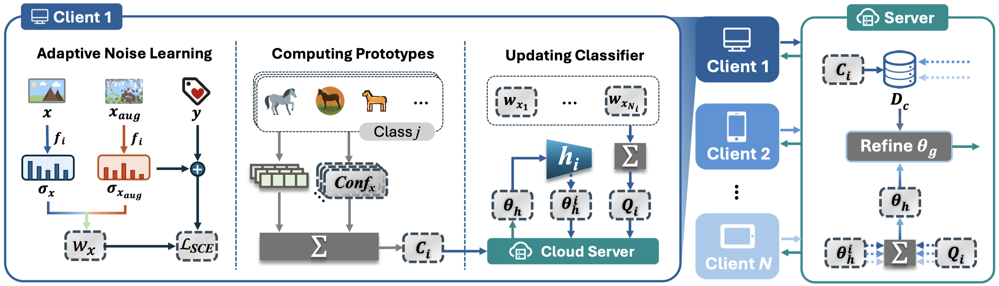

# FedHAN: Robust Federated Learning under Model Heterogeneity and Label Noise

Zaipeng Xie1,✉, Zishu Zhou1, Xuanyao Jie1, Xing Gao1, Han Xu1, and Leihan Wang2

1Hohai University, 2University at Buffalo

## Abstract

Model Heterogeneous Federated Learning (MHFL) extends traditional federated learning by allowing clients to adopt model architectures suited to their local resources and data. While this flexibility improves scalability, it also raises major challenges in cross-client knowledge transfer and robustness under noisy labels. We present FedHAN (Heterogeneity-Aware Noise-Resilient Federated Learning), a framework that integrates noise-robust local objectives, reliability-aware aggregation, and prototype-based refinement into a unified reliability-driven pipeline. This design suppresses the influence of unreliable samples and clients, enabling more stable knowledge sharing across heterogeneous models. We provide a theoretical analysis showing that reliability weighting reduces the effective noise rate and preserves standard nonconvex FL convergence guarantees. Extensive experiments on MNIST, CIFAR-10, and CIFAR-100 with heterogeneous CNN and ResNet clients demonstrate consistent gains over representative MHFL approaches, with improvements up to 5.76% on CIFAR-10 and 4.67% on CIFAR-100 under substantial label noise. Ablation studies further confirm the contribution of each component. These results indicate that FedHAN provides a principled and effective integration of complementary robustness mechanisms, highlighting its potential applicability to MHFL in practical settings characterized by diverse client models and noisy data.

## Supplementary Appendix

Click [[Here]](dd) to download the Supplementary Appendix.
